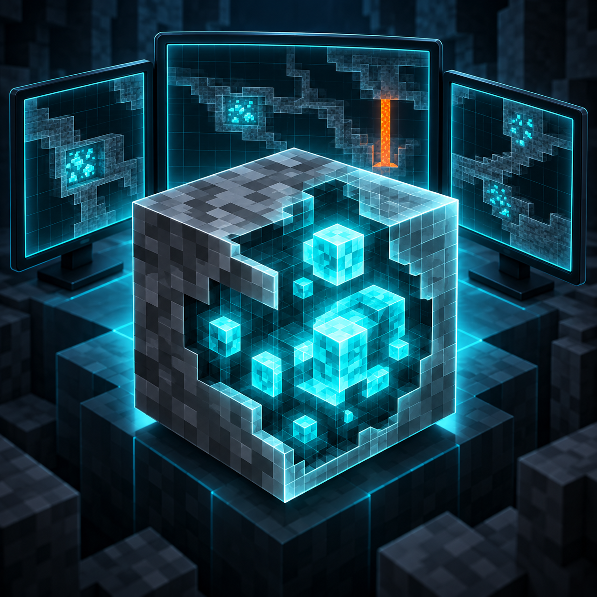
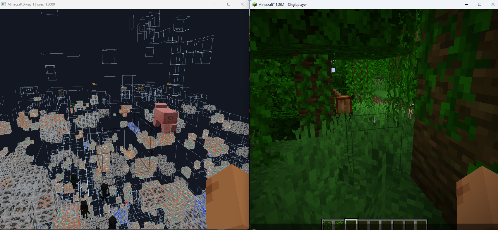
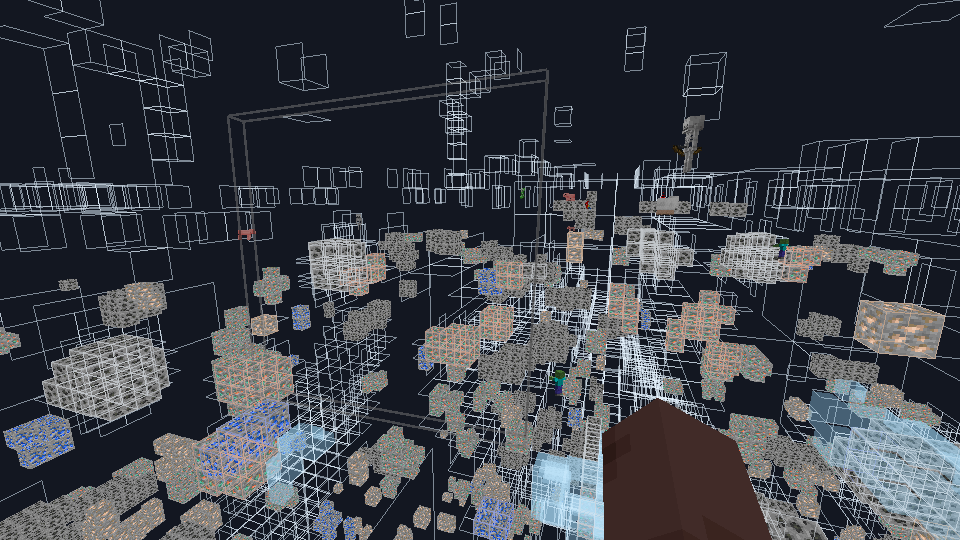
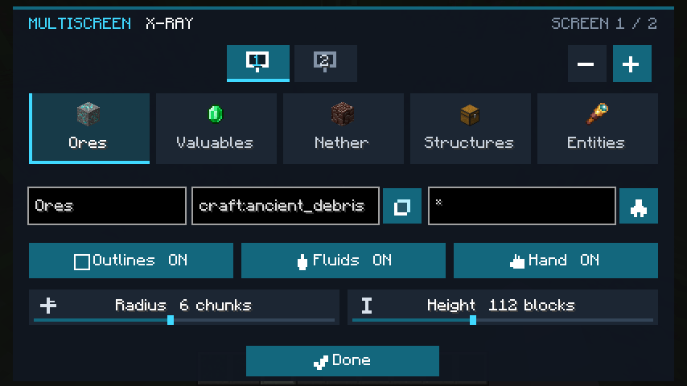
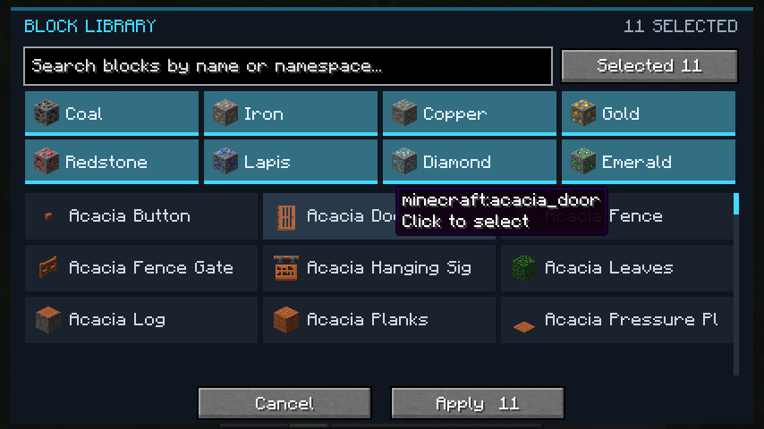
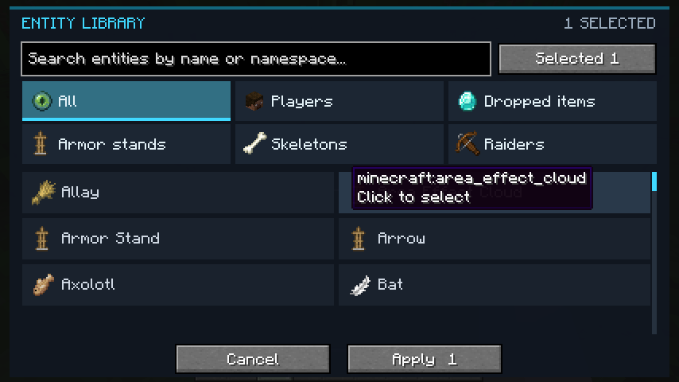

# MultiScreen X-ray

[English](README.md)

  

通常のMinecraft画面とは別に、設定を個別管理できるX-ray画面を複数表示するクライアントMODです。各画面にブロック、エンティティ、プリセット、表示方法、走査範囲、ウィンドウ位置とサイズを保存できます。

## 機能

- X-rayウィンドウを最大8個まで追加
- Minecraft本来のブロックテクスチャを使用
- 周囲のブロックを半透明の輪郭で表示可能
- 明るく補正したエンティティ、流体、プレイヤーの手を描画
- 画面ごとに独立した設定
- アイコン、表示名、検索、全件／選択済み表示を備えたブロック・エンティティ選択画面
- レジストリID、`#タグ`、`*`ワイルドカードによる指定
- 鉱石、貴重品、ネザー、構造物、エンティティのプリセット
- 画面数、フィルター、表示設定、走査範囲、位置、サイズの自動保存
- シングルプレイとマルチプレイで動作するクライアントMOD

## ビジュアル設定

### 画面プロファイルとプリセット

### ブロックライブラリ

### エンティティライブラリ

## 操作

| キー | 操作 |
|---|---|
| `F8` | X-rayウィンドウを追加 |
| `Shift` + `F8` | X-rayウィンドウを削除 |
| `F9` | 設定画面を開く |

設定画面上部のモニターアイコンで編集する画面を選択します。ブロックとエンティティ欄の横にあるライブラリボタンから、対象をアイコン付き一覧で選べます。MOD追加IDや独自タグはテキスト欄へ直接入力できます。

## セレクター

- ブロックID: `minecraft:diamond_ore`
- ブロックタグ: `#minecraft:diamond_ores`
- エンティティID: `minecraft:player`
- エンティティタグ: `#minecraft:raiders`
- 全エンティティ: `*`

複数指定はカンマで区切ります。設定は `config/multiscreenxray.json` に保存されます。

## 対応ブランチ

| ブランチ | Minecraft | ローダー |
|---|---|---|
| `1.20.1` | 1.20.1 | Fabric、Forge |
| `1.20.4` | 1.20.4 | Fabric、Forge、NeoForge |
| `1.21.1` | 1.21.1 | Fabric、Forge、NeoForge |
| `1.21.11` | 1.21.11 | Fabric、Forge、NeoForge |
| `26.2` | 26.2 | Fabric、NeoForge |
| `26.3` | 26.3 | Fabric、NeoForge |

マルチプレイでもサーバーへの導入は不要です。サーバー側のAnti X-ray機能によって、クライアントへ送信される地下ブロックが制限される場合があります。参加するサーバーのルールに従って使用してください。

## ライセンス

[MIT](LICENSE)
